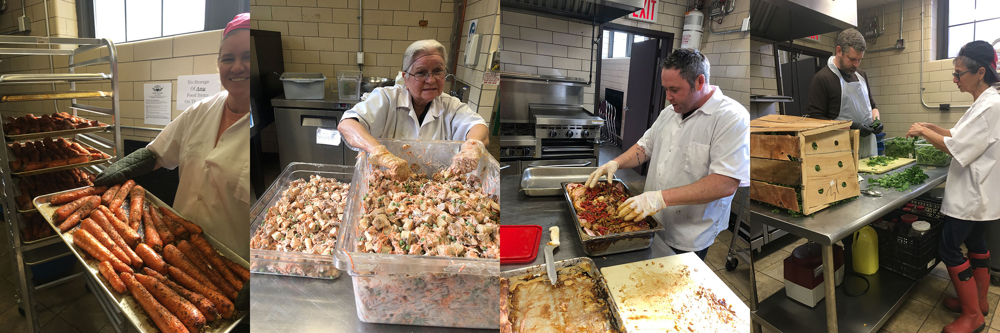
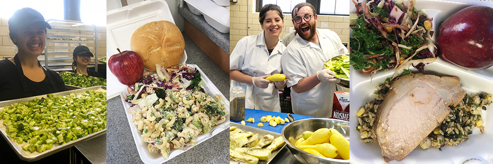

---
# Feel free to add content and custom Front Matter to this file.
# To modify the layout, see https://jekyllrb.com/docs/themes/#overriding-theme-defaults

layout: home
---

Hey there Brooklyn! We are the North Brooklyn Angels, a volunteer-powered, hyper-local, grassroots non-profit that organizes direct action projects to address the many needs that exist in our own backyard: hunger, poverty, homelessness & housing instability.

## Learn more about the need in our community

We run a mobile soup kitchen, called the Angelmobile, which serves hot lunch 6 days a week at various locations around the neighborhood. We cook all the food for our meals in our community kitchen located in the Mt Carmel Parish Hall. Volunteers prep & cook all the food we serve. Volunteers set up & serve all of our lunches. Volunteers do almost everything from dishes to design. Sometimes, they even drive the truck! We are always looking for ways neighbors can band together to help & support a neighbor in need.

## Bringing a Busload of Help

In order to address the meal gap which exists in our neighborhood, we have built a custom food truck complete with office space that operates as a mobile soup kitchen. Thanks to the generous donations and support of the Episcopal Diocese of Long Island and Norm & Elaine Brodsky, we built our Angelmobile and have the ability to bring healthy meals and community resources right to the places they are most needed. Since July 2017, we have been serving a hot lunch Monday through Friday at six sites around North Brooklyn. In addition to feeding people, our office area regularly hosts representatives from local city council offices, housing counselors, and healthcare advocates and our community table distributes information & flyers in addition to free clothes, books, toys, and personal hygiene products.

## Cooking It Up in the Community Kitchen

Thanks to the generous support from Elaine and Norm Brodsky, Msgr. Jamie Gigantiello, and local restaurateur Josh Cohen, the North Brooklyn Angels are preparing all of their meals in a brand new kitchen!

Built in the Parish Hall of Our Lady of Mount Carmel Church, our community kitchen was made possible by local donations and loans. Led by our Kitchen Captains, Donna Sinetar and Josh, volunteers prep and cook 1,000 healthy meals a week for our neighbors. The community kitchen is always bustling with action and we are always actively recruiting new volunteers to keep the magic working. In addition to prep shifts, we rely on dishwashers, cleaning staff, help with inventory, people to transport food donations to our kitchen, and outreach volunteers.

Stop by and say hello at our kitchen or when you see us out in the neighborhood. We look forward to hearing all your idea about how neighbors can help neighbors.

# How Can You Help?

Sign up for our email list so you can join us to donate, volunteer, and advocate for our community. Donate because giving is not just for the holiday season as ending hunger is an everyday battle. We don’t receive any government funds, instead fundraising from our generous neighbors and businesses. Volunteer and share your skills with us in direct-action projects to combat food insecurity and address poverty in North Brooklyn. Advocate for your neighbors by spreading the word about our work, learning more about our program and the issues of poverty in North Brooklyn, by following us on Instagram, Facebook, & Twitter. Our hunger program is only the beginning; there’s lots more good to do. If there is an issue or an action that you are passionate about then join us to help create a local and loving solution.

